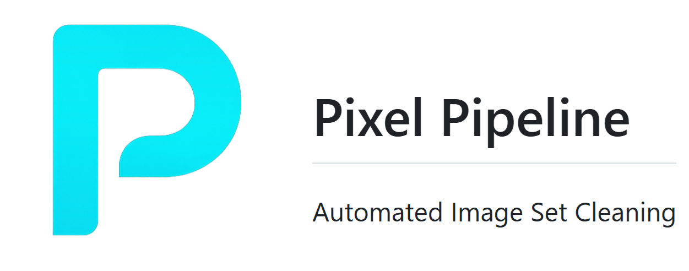

## What is it?

Pixel Pipeline is a desktop application that helps you refine image datasets for AI training by cleaning, filtering, and enhancing your image collections. It offers a comprehensive set of tools for removing duplicates, filtering images by face count, reducing dataset size while maintaining diversity, and generating high-quality AI captions.

## Features

### Complete Image Dataset Refinement Workflow

- **Image Similarity Detection**: Remove duplicates and visually similar images
  - Perceptual hash for exact duplicates
  - VGG16-based similarity detection for visually similar images

- **Face Detection & Filtering**: Sort images by face count
  - Multiple detection algorithms (MTCNN, MediaPipe, YuNet, etc.)
  - Automatic sorting into no-face, single-face, and multiple-face categories

- **Image Set Refinement**: Intelligently reduce dataset size
  - Face embedding and clustering
  - Diversity or consistency-based selection
  - Interactive visualization of clustering results

- **AI-Powered Image Captioning**: Generate high-quality captions
  - Qwen2.5-VL vision-language models (3B & 7B variants)
  - Custom prompting for tailored descriptions
  - Flux-compatible identifier generation
  - Caption export as ZIP files

## System Requirements

- **Python**: 3.11.9 or compatible
- **CUDA**: 12.8 (Blackwell compatible)
- **PyTorch**: Nightly builds of torch and torchvision (Blackwell compatible)
- **RAM**: 8GB minimum, 16GB+ recommended
- **GPU**: NVIDIA GPU with 6GB+ VRAM recommended for optimal performance
- **Storage**: 10GB+ free space for models and temporary files

## Installation

1. Clone this repository:
```bash
git clone https://github.com/yourusername/pixel-pipeline.git
cd pixel-pipeline
```

2. Create and activate a virtual environment:
```bash
python -m venv venv

# On Windows
venv\Scripts\activate

# On macOS/Linux
source venv/bin/activate
```

3. Install the required dependencies:
```bash
pip install -r requirements.txt
```

**Note for CUDA compatibility**: This project requires CUDA 12.8 compatible PyTorch. The requirements.txt file includes the correct version specifications.

## Usage

### Launching the Application

Run the application using the included batch file (recommended):

```bash
run.bat
```

Or launch directly with Python:

```bash
python app.py
```

The application will open in your default web browser at http://localhost:7865.

### Recommended Workflow

For best results, follow this sequence:

1. **Image Similarity Tab**: First remove duplicates and overly similar images
2. **Face Detection Tab**: Next, filter images based on face count (for character LoRA training)
3. **Image Set Refinement Tab**: Reduce dataset size while maintaining diversity or consistency
4. **Image Captioning Tab**: Finally, add AI-generated captions to your refined dataset

## FAQ

### Why am I getting CUDA/GPU errors?
Ensure you have NVIDIA drivers installed that support CUDA 12.8. You can also try using a smaller batch size or the 3B model variant for captioning if you have limited VRAM.

### Can I run this without a GPU?
Yes, but performance will be significantly slower, especially for face detection, clustering, and captioning tasks.

### How do I report a bug or request a feature?
Please open an issue on the GitHub repository with a detailed description of the bug or feature request.

### What image formats are supported?
Pixel Pipeline supports JPG, PNG, and JPEG image formats.

### How many images can I process at once?
This depends on your hardware. With sufficient RAM and VRAM, you can process hundreds or thousands of images, but for optimal performance, consider batching large datasets.

## Contributing

Contributions are welcome! Please feel free to submit a Pull Request.

1. Fork the repository
2. Create your feature branch (`git checkout -b feature/amazing-feature`)
3. Commit your changes (`git commit -m 'Add some amazing feature'`)
4. Push to the branch (`git push origin feature/amazing-feature`)
5. Open a Pull Request

## License

MIT License

## Acknowledgments

- This application utilizes the [Qwen2.5-VL](https://github.com/QwenLM/Qwen-VL) model from Alibaba
- Built with [Gradio](https://www.gradio.app/) for the user interface
- [Hugging Face Transformers](https://huggingface.co/docs/transformers/index) for model integration
- Face detection and analysis powered by various open-source libraries including DeepFace and FaceNet
